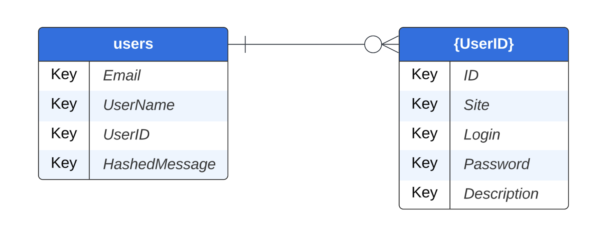

# NPass - Backend for a password manager

## Overview
NPass is a backend for a password manager written in flask. It uses a MySql DB hosted locally for storing user secrets. The user secrets is encrypted using AES (a symmetric key encryption algorithm) and can be decrypted only if Master Password is known. 
## Technology

**Language** : Python  
**Framework** : Flask  
**Encryption** : AES -ECB mode  
**ORM**: SQLAlchemy  
## Prerequisite

Set up a MySql DB before following these installation steps. 
## Installation

1. Clone the repository: `git clone https://github.com/Niyaz2498/NPass-backend.git`
2. Create a virtual environment (recommended).
3. Install dependencies: `pip install -r requirements.txt`
4. Export the following values in terminal.
	1. mysqluser
	2. mysqlpass
	3. mysqlport
	4. dbname
## Running the app
`flask run` command runs the app. if you run the app in some machine connected in network and want to access it in your machine, use the flag `--host=0.0.0.0`

## Routes 

| Route | Method | Description |
| ----- | ------ | ----------- |
| /users/create | POST | This is the method to create new users.|
| /secret/query | POST | This returns a stringified JSON of user Secrets | 
| /secret/add | POST | This is used to add a new secret for specified user | 
| /secret/update | POST | This method is to modify a secret specified by user |
| /secret/delete | POST | This method is to delete a stored secret | 

## Database Structure

The user table contains the list of all users using this application. **we don't store master password anywhere** . If we have to check whether the master password is right,  we can decrypt the HashedMessage of the user and check if it returns `Test Message` . 

A separate table is created for each user with the UserID as table name where the secrets of each user is stored. The secrets are **encrypted with the master password** and should be decrypted with master password before sending back to user. 

The following images can provide a bit more clarity on DB

This is how the values looks when decrypted

